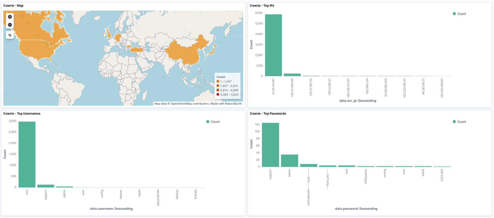
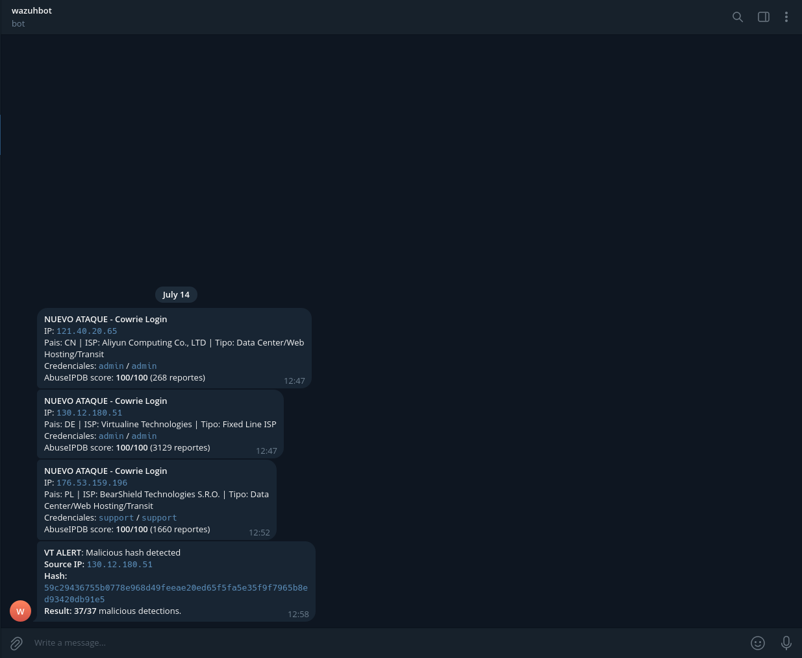

# Cowrie Honeypot + Wazuh SOC

A home-built SOC to capture, detect, and analyze real-world SSH attacks. A Raspberry Pi runs [Cowrie](https://github.com/cowrie) as an SSH honeypot exposed to the internet, while a Wazuh stack (deployed via Docker) ingests logs, applies custom detection rules, geolocates attacker IPs, and provides centralized visualization.

## Project Overview

Attackers scanning the internet for open SSH ports connect to the honeypot, believing it to be a vulnerable server. Cowrie logs all adversary activity. Wazuh receives these logs in real-time, classifies them with custom rules, correlates patterns like brute-force attempts, tags them against MITRE ATT&CK techniques, and geolocates the source IPs for actionable intelligence.

## Key Features

* **Honeypot:** Cowrie deployment, isolated and running on a Raspberry Pi.
* **Log Management:** Automated ingestion of JSON logs into the Wazuh Manager.
* **Detection:** Custom detection rules for specific Cowrie events (login, command execution, file uploads/downloads, TCP tunneling) mapped to MITRE ATT&CK.
* **Enrichment:** Automated Python scripts to correlate Indicators of Compromise (IoCs) with **AbuseIPDB** and **VirusTotal**, providing real-time alerts via **Telegram**.
* **Geo-intelligence:** Ingestion pipeline integration with MaxMind GeoLite2 for real-time geographic visibility.
* **Dashboard:** Centralized OpenSearch/Wazuh dashboard featuring attacker metrics, credential analysis, and an interactive world map.

## Repository Structure

.
├── docs/       # Step-by-step deployment and configuration guides
├── images/     # Images needed for the README.md
├── report/     # Detailed investigation of captured attack patterns (in progress)
└── scripts/    # Python automation scripts (AbuseIPDB, VirusTotal integration)

## Tech Stack

Cowrie, Wazuh (Manager, Indexer, Dashboard), Docker, OpenSearch, MaxMind GeoLite2, Python.

## Documentation

- [docs/deployment-cowrie.md](docs/deployment-cowrie.md): Honeypot setup, network configuration, and event reference.
- [docs/deployment-wazuh.md](docs/deployment-wazuh.md): Wazuh installation, custom rule engineering, GeoIP, and dashboard setup.
- [report/](report/): Findings and analysis of malicious actors targeting the honeypot.

---
*Note: To deploy, remember to replace the API tokens in the scripts.
